# 🔍 MonPhare

**Terraform/OpenTofu module constraint analyzer and dependency mapper.**

[](https://github.com/yourusername/monphare/actions/workflows/ci.yml)
[](https://crates.io/crates/monphare)
[](https://docs.rs/monphare)
[](https://opensource.org/licenses/MIT)

MonPhare scans Terraform/OpenTofu repositories, parses HCL files, builds dependency graphs, and detects version constraint conflicts, deprecated modules, and risky patterns.

## ✨ Features

- **🔄 Multi-Provider Git Support**: Clone repositories from GitHub, GitLab, Bitbucket, and Azure DevOps
- **📝 HCL Parsing**: Extract module blocks, provider requirements, and version constraints
- **🕸️ Dependency Graph**: Build and visualize module/provider relationships
- **⚠️ Conflict Detection**: Identify version constraint conflicts across repositories
- **🚨 Risk Analysis**: Flag deprecated modules, missing constraints, and risky patterns
- **📊 Multiple Output Formats**: JSON, plain text, and self-contained HTML reports
- **🔧 CI/CD Ready**: Exit codes for automated pipeline checks

## 🚀 Quick Start

### Installation

```bash
# From crates.io
cargo install monphare

# From source
git clone https://github.com/yourusername/monphare
cd monphare
cargo install --path .
```

### Basic Usage

```bash
# Scan a local directory
monphare scan ./terraform

# Scan multiple directories
monphare scan ./repo1 ./repo2 ./repo3

# Scan remote repositories
monphare scan --repo https://github.com/org/repo1 --repo https://github.com/org/repo2

# Generate JSON report
monphare scan ./terraform --format json --output report.json

# Generate HTML report
monphare scan ./terraform --format html --output report.html

# Generate dependency graph
monphare graph ./terraform --format dot --output deps.dot
```

### Configuration

Create a `monphare.yaml` file:

```yaml
# monphare.yaml
scan:
  exclude_patterns:
    - "**/test/**"
    - "**/examples/**"
  continue_on_error: true

analysis:
  check_exact_versions: true
  check_prerelease: true
  max_age_months: 12

output:
  colored: true
  verbose: false

policies:
  require_version_constraint: true
  require_upper_bound: false
```

Generate an example configuration:

```bash
monphare init
```

## 📖 Documentation

### CLI Commands

| Command | Description |
|---------|-------------|
| `scan` | Scan directories or repositories for Terraform files |
| `graph` | Generate dependency graph visualization |
| `init` | Create an example configuration file |
| `validate` | Validate a configuration file |

### Scan Options

```bash
monphare scan [OPTIONS] [PATHS]...

Options:
  -r, --repo <URL>          Git repository URLs to clone and scan
  -f, --format <FORMAT>     Output format [default: text] [values: json, text, html]
  -o, --output <FILE>       Output file path (stdout if not specified)
      --strict              Treat warnings as errors
      --continue-on-error   Continue scanning even if some files fail
  -e, --exclude <PATTERN>   Patterns to exclude from scanning
      --branch <BRANCH>     Git branch to checkout
      --git-token <TOKEN>   Git authentication token
  -v, --verbose             Increase verbosity
  -q, --quiet               Suppress all output except errors
```

### Exit Codes

| Code | Meaning |
|------|---------|
| 0 | Success - no issues found |
| 1 | Warnings found (with `--strict`) |
| 2 | Errors found |

## 🏗️ Architecture

```
monphare/
├── src/
│   ├── lib.rs           # Library entry point
│   ├── main.rs          # CLI entry point
│   ├── types.rs         # Core data structures
│   ├── error.rs         # Error types
│   ├── config.rs        # Configuration handling
│   ├── parser/          # HCL parsing
│   │   ├── mod.rs
│   │   ├── hcl.rs       # HCL parser implementation
│   │   └── source.rs    # Module source parsing
│   ├── graph/           # Dependency graph
│   │   ├── mod.rs       # Graph documentation
│   │   ├── types.rs     # Graph types
│   │   ├── builder.rs   # Graph construction
│   │   └── export.rs    # Graph export (DOT, JSON, Mermaid)
│   ├── analyzer/        # Constraint analysis
│   │   ├── mod.rs
│   │   ├── conflict.rs  # Conflict detection
│   │   └── patterns.rs  # Risky pattern detection
│   ├── reporter/        # Report generation
│   │   ├── mod.rs
│   │   ├── json.rs      # JSON reports
│   │   ├── text.rs      # Text reports
│   │   └── html.rs      # HTML reports
│   ├── git/             # Git provider abstraction
│   │   ├── mod.rs
│   │   ├── client.rs    # Git client
│   │   └── providers.rs # Provider implementations
│   └── cli/             # CLI interface
│       └── mod.rs
├── tests/
│   ├── fixtures/        # Test Terraform files
│   └── integration_tests.rs
└── .github/
    └── workflows/
        └── ci.yml       # GitHub Actions CI
```

## 🔬 Finding Types

### DRIFT001 - Version Constraint Conflict

Two modules or providers require incompatible versions.

```
[ERROR] DRIFT001: Version constraint conflict for 'hashicorp/aws': '>= 5.0' vs '<= 4.5'
```

### DRIFT002 - Missing Version Constraint

A module or provider has no version constraint specified.

```
[WARNING] DRIFT002: Module 'vpc' has no version constraint
```

### DRIFT003 - Wildcard Constraint

A constraint uses wildcards (`*`).

```
[WARNING] DRIFT003: 'my-module' uses wildcard version constraint
```

### DRIFT004 - Overly Broad Constraint

A constraint is too permissive (e.g., `>= 0.0.0`).

```
[WARNING] DRIFT004: Module 'vpc' has overly broad constraint: >= 0.0.0
```

### DRIFT005 - Pre-release Version

A constraint references a pre-release version.

```
[INFO] DRIFT005: 'my-module' uses pre-release version
```

### DRIFT006 - Exact Version Constraint

An exact version constraint prevents automatic updates.

```
[INFO] DRIFT006: 'eks' uses exact version constraint
```

### DRIFT007 - No Upper Bound

A constraint has no upper bound, allowing breaking changes.

```
[WARNING] DRIFT007: 'my-module' has no upper bound on version
```

## 📊 Example Output

### Text Report

```
═══════════════════════════════════════════════════════════════
  MonPhare Analysis Report v0.1.0
Generated: 2024-01-15 10:30:00
═══════════════════════════════════════════════════════════════

📊 Summary
----------------------------------------
  Files scanned:    15
  Modules found:    8
  Providers found:  3
  Total findings:   5
    2 Errors, 2 Warnings, 1 Info

🔍 Findings
----------------------------------------

  [ERROR] Version constraint conflict for 'terraform-aws-modules/vpc/aws' (DRIFT001)
    → repo-a/main.tf:10
    → repo-b/main.tf:5
    The constraints '>= 5.0' and '<= 4.0' have no overlapping versions.
    💡 Consider aligning the constraints.

  [WARNING] Module 'eks' has no version constraint (DRIFT002)
    → main.tf:25
    💡 Add a version constraint, e.g., version = "~> 1.0"

✅ PASSED with warnings
```

### Dependency Graph (Mermaid)

```mermaid
graph TD
    subgraph Modules
        vpc["📦 vpc"]
        eks["📦 eks"]
    end
    subgraph Providers
        aws(("🔌 hashicorp/aws"))
    end
    vpc -.-> aws
    eks -.-> aws
    eks --> vpc
```



## 🔧 Library Usage

```rust
use monphare::{Scanner, Config, ReportFormat};

#[tokio::main]
async fn main() -> anyhow::Result<()> {
    let config = Config::default();
    let scanner = Scanner::new(config);

    // Scan a local directory
    let result = scanner.scan_path("./terraform").await?;

    // Check for issues
    if result.analysis.has_errors() {
        eprintln!("Errors found!");
    }

    // Generate a report
    let report = result.generate_report(ReportFormat::Json)?;
    println!("{}", report);

    Ok(())
}
```

## 🤝 Contributing

Contributions are welcome! Please read our [Contributing Guide](CONTRIBUTING.md) for details.

1. Fork the repository
2. Create your feature branch (`git checkout -b feature/amazing-feature`)
3. Commit your changes (`git commit -m 'Add amazing feature'`)
4. Push to the branch (`git push origin feature/amazing-feature`)
5. Open a Pull Request

## 📜 License

This project is licensed under the MIT License - see the [LICENSE](LICENSE) file for details.

## 🗺️ Roadmap

- [ ] **v0.2.0**: REST API for SaaS dashboard integration
- [ ] **v0.3.0**: GitHub Actions integration
- [ ] **v0.4.0**: Pulumi support
- [ ] **v0.5.0**: Auto-remediation suggestions
- [ ] **v1.0.0**: Production release

## 🙏 Acknowledgments

- [hcl-rs](https://github.com/martinohmann/hcl-rs) - HCL parsing
- [petgraph](https://github.com/petgraph/petgraph) - Graph data structures
- [clap](https://github.com/clap-rs/clap) - CLI framework

